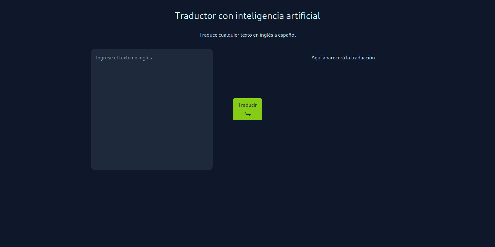
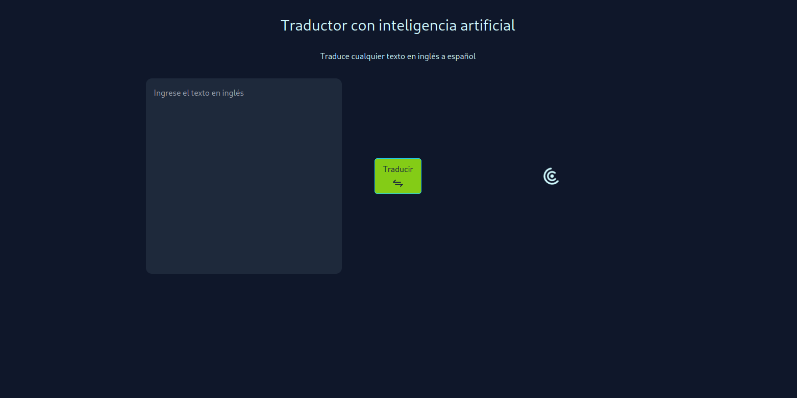
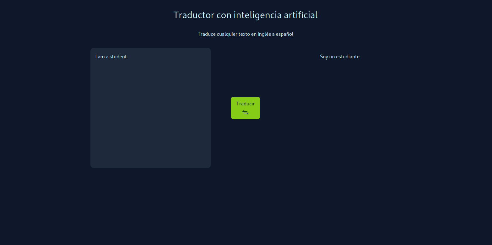

# Traducir de inglés a español con inteligencia artificial

Este proyecto surgió como idea gracias a los ejemplos que hay en la API de OpenAI.

### Tecnologías usadas:
- [React JS](https://reactjs.org) 
- [Tailwind CSS](https://tailwindcss.com)
- [OpenAI API](https://openai.com/api/)
- [Vite JS](https://vitejs.dev)
- [Vercel](https://vercel.com)
- [Tabler Icons](https://tabler-icons.io)
- [SVGR](https://react-svgr.com)

## Funcionamiento:

Contiene un textarea para escribir el texto en inglés y un botón para ejecutar la petición a la API. (Si el textarea está vacío traduce una frase aleatoria devuelta por la API)

Al ejecutar la petición mientras se espera la respuesta muestra un icono de cargando para darle feedback al usuario.

Después muestra la traducción correspondiente.

